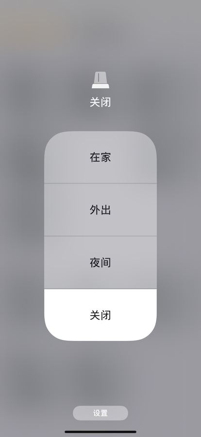

# 目的
更好滴融合hass、HomeKit和小米网关，提高自动化水平。

# 简介
把homeassistant/components/xiaomi_aqara/路径下的__init__.py和services.yaml替换为本repo所提供的代码，为homeassistant的xiaomi_aqara组件增加一项服务：模拟无线按钮（原名无线开关），可以模拟单击和双击。

当然，不替换services.yaml也不影响使用，只是在开发者工具下面使用这项服务的时候没有介绍信息而已。诺，就是这个：


### sensor.py
这个文件修改了两个传感器：
 - 去掉了网关自带的小夜灯 light，原因是通过LAN API控制这个灯之后，在原生app米家里会失控，米家app里设置的相关自动化会无效。
 
 - 原代码不知是出于什么考虑，把网关上的照度传感器上报的数值进行了修改，减掉300.个人认为这个修改很不合理，所以把这个修改去掉了。
 
 # 发挥作用
 homeassistant集成的xiaomi_aqara组件无法利用小米网关的警戒功能，原因是官方提供的局域网通信协议（LAN API）没有提供相应的能力。
 
 为了弥补这个缺陷，以及实现更好的离家/回家自动化，达到离家自动布防、回家自动撤防的目的，我进行了一系列的设置和改造：
 
 0. 专门征用一个无线按钮（原名无线开关）和一个zigbee智能插座。这两个东西就不要用于其他用途了。zigbee插座务必要关闭“断电记忆”！这个插座是一个非常重要的桥梁，后面还会说到。
 
 1. homeassistant增加一个虚拟的报警控制面板：
 ``` yaml
 alarm_control_panel:
  - platform: manual
    pending_time: 5
    trigger_time: 3
    disarm_after_trigger: false
    disarmed:
      trigger_time: 0
    armed_away:
      pending_time: 5
      delay_time: 3
```
然后想尽办法让这个面板与小米网关的警戒模式保持同步，也就是接下来的设置和改造。

2. 在原生的米家app里增加两个自动智能条目（原来叫自动化），分别为：
 - 单击-离家
   - 关闭zigbee插座 （这一动作可以去掉）
   - 启动警戒模式（布防）
   - 其他动作，比如开启摄像头等
 - 双击-回家
   - 关闭警戒模式（撤防）
   - 其他动作，比如关闭摄像头等
3. 另外，我使用的是米家上的一款支持蓝牙协议的智能门锁（其实应该买aqara的zigbee协议的门锁，可惜当时不知道）。而蓝牙门锁是没有局域网协议接口的，并且所有的联动都只能通过云端的服务器执行。虽然延迟比较大，但总好过没有啊。所以也创建一条自动化加以利用：
  - 正常开锁-撤防
    - 关闭警戒模式（撤防）
    - 其他动作，如关闭摄像头等
    - 开启zigbee插座 （这个插座开启的信号是给homeassistant专门准备的）
    - 延时1分钟
    - 关闭zigbee插座
4. 在homeassistant上定制自动化：
### 离家自动布防：
借助于另外一个很棒的脚本，[monitor](https://github.com/andrewjfreyer/monitor)，我和家人的手机全部离开蓝牙可见范围，homeassistant就会发出无线按钮单击的信号，小米网关收到后就会执行预先设置的“单击-离家”智能条目。
```yaml
- id: '2892191838'
  alias: alarm.outARM
  trigger:
  - below: '50'
    entity_id: sensor.chome //这是表征我和家人手机在家与否的一个传感器，来自monitor
    platform: numeric_state
  condition: []
  action:
  - data:
      device_id: xxxx
      gw_mac: xxxx
      status: click
    service: xiaomi_aqara.simulate_button
  - data:
      entity_id: alarm_control_panel.ha_alarm
    service: alarm_control_panel.alarm_arm_away
  - data:
      message: HA进入警戒状态！
    service: notify.notify
```
### 回家自动撤防，为了适应不同状况，设置了两个自动化，分别为：
#### 正常开锁-撤防：
其实homeassistant根本获取不到开锁的信号，只能通过zigbee插座开启这一事件进行传递。这种情况下是米家服务器先检测到开锁，自然就会执行“开锁-撤防”，剩下的只是需要通知homeassistant：
```yaml
- id: '33928032'
  alias: alarm.plugOnDISARM
  trigger:
  - entity_id: switch.lvmiplug
    from: 'off'
    platform: state
    to: 'on'
  condition:
  - condition: state
    entity_id: alarm_control_panel.ha_alarm
    state: armed_away
  action:
  - data:
      entity_id: alarm_control_panel.ha_alarm
    service: alarm_control_panel.alarm_disarm
  - data:
      data:
        push:
          sound: US-EN-Morgan-Freeman-Front-Door-Unlocked.wav
      message: zb插座开启，正常开锁，已解除警戒。
    service: notify.notify
```
#### 主人回家-撤防
还是那个[monitor](https://github.com/andrewjfreyer/monitor)，我或者家人的手机回到家门口蓝牙可见范围内，homeassistant发出无线按钮双击模拟消息，小米网关收到后立即执行“双击-回家”：
```yaml
- id: '882743628'
  alias: alarm.homeDISARM
  trigger:
  - above: '95'
    entity_id: sensor.chome
    platform: numeric_state
  condition:
  - condition: state
    entity_id: alarm_control_panel.ha_alarm
    state: armed_away
  action:
  - data:
      device_id: xxxx
      gw_mac: xxxx
      status: double_click
    service: xiaomi_aqara.simulate_button
  - data:
      entity_id: alarm_control_panel.ha_alarm
    service: alarm_control_panel.alarm_disarm
  - data:
      data:
        push:
          sound: US-EN-Alexa-Welcome-Home.wav
      message: 欢迎回家，解除警戒状态。
    service: notify.notify
```
5. HomeKit集成及应用

我用的是苹果手机，不用上HomeKit就太说不过去了。

首先是homeassistant的配置：
```yaml
homekit:
  filter:
    exclude_domains: //不想在苹果家庭app看到这些
      - group.all_switches
      - group.all_automations
      - group.all_devices
      - group.all_remotes
      - automation
    exclude_entities:
      - remote.miir
      - device_tracker.ipadmini
      - switch.lvmiplug //刻意隐藏，避免误操作导致撤防。
```
然后是两个自动化：

万一外出后没有自动布防，可以在苹果家庭app里把报警面板的状态改为“外出”，小米网关就会自动执行布防自动化。

```yaml
- id: '1882373283'
  alias: alarm.homekitARMcmd
  trigger:
  - event_data:
      display_name: HA Alarm
      entity_id: alarm_control_panel.ha_alarm
      service: alarm_arm_away
    event_type: homekit_state_change
    platform: event
  condition: []
  action:
  - data:
      device_id: xxxxx
      gw_mac: xxxxx
      status: click
    service: xiaomi_aqara.simulate_button
  - data:
      message: HomeKit指令：进入警戒状态！
    service: notify.notify
```
苹果的地理围栏功能据说可以甩安卓几条街，虽然对于住楼房的我们适用性一般（像农村自己家一个院子应该很好用），但也可以加以利用：

首先当然是在手机上，苹果家庭app，设置一条“回家-关闭警戒”的自动化。

然后，在homeassistant增加一条配合的自动化：
```yaml
- id: '992763512'
  alias: alarm.homekitDISARM
  trigger:
  - event_data:
      display_name: HA Alarm
      entity_id: alarm_control_panel.ha_alarm
      service: alarm_disarm
    event_type: homekit_state_change
    platform: event
  condition: []
  action:
  - data:
      device_id: xxxx
      gw_mac: xxxxx
      status: double_click
    service: xiaomi_aqara.simulate_button
  - data:
      message: HomeKit指令：解除警戒。
    service: notify.notify
```
